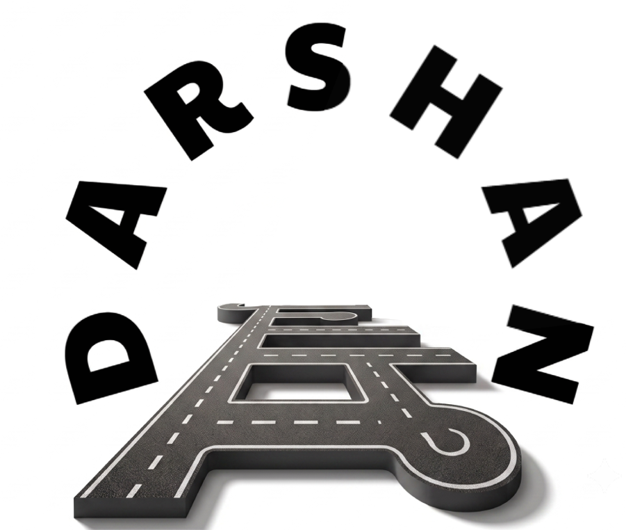
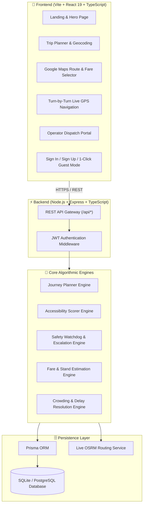

<div align="center">

  

  # मार्ग Darshan (Maarg Darshan)
  ### *Safer, Smarter & Inclusive Accessible Public Transit Navigation*

  [](https://vitejs.dev/)
  [](https://react.dev/)
  [](https://www.typescriptlang.org/)
  [](https://tailwindcss.com/)
  [](https://nodejs.org/)
  [](https://www.prisma.io/)
  [](LICENSE)

  <p align="center">
    <b>Your Journey. Your Accessibility. Your Safety.</b><br />
    <i>Not just the fastest route — the SAFEST and most ACCESSIBLE route for YOU.</i>
  </p>

</div>

---

## 📌 Executive Summary

**मार्ग Darshan (Maarg Darshan)** is an accessibility-first public transport and micro-transit navigation platform built to empower passengers with mobility challenges, elderly commuters, wheelchair users, and late-night travellers.

Unlike traditional mapping applications that exclusively optimize for shortest travel time, **Maarg Darshan** algorithms evaluate real-world infrastructure parameters:
- ♿ **Zero-Step Accessibility**: Ramps, station elevators, step-free sidewalks, and low-floor electric buses.
- 🚖 **Shared Micro-Transit Discovery**: Automatic detection of closest famous shared auto/taxi stands with fare estimation.
- 🛡️ **Proactive Safety Watchdog**: Real-time live GPS tracking, background safety monitoring, emergency SOS escalation, and automatic verified safe arrival detection.
- 👥 **Live Crowd & Delay Reporting**: Community-driven reporting of bus delays, vehicle occupancy, and broken ramps.
- 📱 **Minimalist Ola/Uber Experience**: Clean, uncluttered UI with 1-click guest mode and continuous Google Maps-style route polylines.

---

## 🚀 Commercial Modules Matrix

| Module | Core Capabilities | Production Status |
| :--- | :--- | :---: |
| **1. Route & Stop Discovery** | • Live geocoding with instant autocomplete.<br>• Nearest public bus stops with ramp certifications.<br>• Closest shared taxi/auto stands with distance and typical fares.<br>• Exact & range fare calculations (Bus: ₹15–₹20, Auto: ₹25–₹40). | ✅ **Ready** |
| **2. Accessible-Route Planning** | • Multi-criteria algorithmic ranking engine.<br>• Wheelchair (100% step-free, 0 stairs), Senior (minimal walking), Night Travellers (well-lit corridors).<br>• Continuous start-to-end Google Maps-style blue polyline. | ✅ **Ready** |
| **3. Crowding, Delay & Condition Reporting** | • In-journey passenger reporting modal.<br>• Real-time reports for heavy crowding, vehicle delays, broken ramps, and lighting outages.<br>• Feed updates directly to dispatch and fellow commuters. | ✅ **Ready** |
| **4. Safety Check-in & Emergency Watchdog** | • Quiet background safety monitoring.<br>• One-click **"I'm Safe"** verification.<br>• One-click **"Emergency SOS"** broadcasting live GPS coords to emergency contacts & transit control.<br>• Automatic **"Verified Safe Arrival 🎉"** screen upon destination reach. | ✅ **Ready** |
| **5. Arrival & Route-Change Notifications** | • Real-time push alert center (`/notifications`).<br>• Filtered alert streams for Delays, Crowding, Accessibility, Safety, and System events. | ✅ **Ready** |
| **6. Driver & Operator Dashboard** | • Dedicated operator dispatch portal (`/operator`).<br>• Real-time vehicle fleet telemetry, delay injection, crowd level overrides, and passenger report triage. | ✅ **Ready** |
| **7. Offline Route Information** | • 1-Click **"Download Offline Transit Pack"** (`/profile`).<br>• Pre-cached schedule data, corridor maps, and emergency contacts for zero-connectivity zones. | ✅ **Ready** |

---

## 🏗️ System Architecture



---

## 🛠️ Technology Stack

### **Frontend**
- **Framework**: React 19 with Vite 6
- **Language**: TypeScript 5.8
- **Styling**: Tailwind CSS with custom Ola/Uber-inspired design system
- **Mapping**: Leaflet & React-Leaflet with OpenStreetMap & custom SVG map markers
- **Icons**: Lucide React
- **State Management**: React Context + Centralized Reducer Architecture

### **Backend**
- **Runtime**: Node.js LTS (v20+ / v24+)
- **Framework**: Express.js with TypeScript
- **Database ORM**: Prisma ORM
- **Database**: SQLite (Development) / PostgreSQL (Production)
- **Security**: bcrypt password hashing, JSON Web Tokens (JWT), input validation via Zod
- **Testing**: Vitest integration testing suite (22/22 unit & route tests passing)

---

## 🏁 Quickstart & Installation

### Prerequisites
- [Node.js](https://nodejs.org/) v18+ or v24+
- `npm` v9+
- `git`

### 1. Clone the Repository
```bash
git clone https://github.com/novonil-31/Travel.git
cd Travel
```

### 2. Setup & Start Backend
```bash
cd backend
npm install
npx prisma generate
npx prisma db push
npm run seed
npm run dev
```
> Backend API will be active on **`http://localhost:3000`**

### 3. Setup & Start Frontend
In a new terminal window:
```bash
cd ..
npm install
npm run dev
```
> Frontend application will be live at **`http://localhost:5173`**

---

## 📖 Key User Journeys

### 1. 1-Click Guest & Accessibility Calibration
- Open **[http://localhost:5173/login](http://localhost:5173/login)**
- Tap **"⚡ Continue as Guest (One-Time / No Login)"** or select a 1-click persona (**♿ Wheelchair** or **👵 Senior Citizen**).

### 2. Search & Fare Estimation
- Enter pickup point (or click GPS locate) and destination.
- View discovered **Nearby Public Bus Stops** (with ramp status) and **Closest Shared Auto Stands** (with typical fare ranges).
- Click **"See Routes & Fares"**.

### 3. Google Maps Continuous Route & Uber-Style Ride Selection
- Inspect the continuous vibrant blue route line on the interactive map.
- Select your preferred transit option:
  - **♿ Low-Floor Bus Line C3** (Recommended • 25 min • **₹20**)
  - **⚡ Express Transit Line C2** (Fastest • 20 min • **₹15**)
  - **🚖 Shared Auto Stand S1** (Doorstep stand • 18 min • **₹25–₹40**)
- Click **"Start Navigation"**.

### 4. Live Turn-by-Turn Navigation & Automatic Safe Arrival
- Track live movement with remaining distance countdown (`1.2 km` → `400m` → `45m`).
- Submit condition reports (*Heavy Crowding*, *Vehicle Delay*, *Ramp Broken*).
- When reaching destination, the system triggers the **"🎉 Verified Safe Arrival"** screen and sends confirmation to designated emergency contacts.

---

## 👥 Hackathon Details

- **Event**: HACQUIRE 2026
- **Problem Statement**: PS-05 — *Accessible Public Transport Assistant*
- **Team Name**: CLUELESS
- **Team ID**: HA-095-6558
- **Project**: मार्ग Darshan (Maarg Darshan)

---

## 📄 License

This project is licensed under the **MIT License** — see the [LICENSE](LICENSE) file for details.
